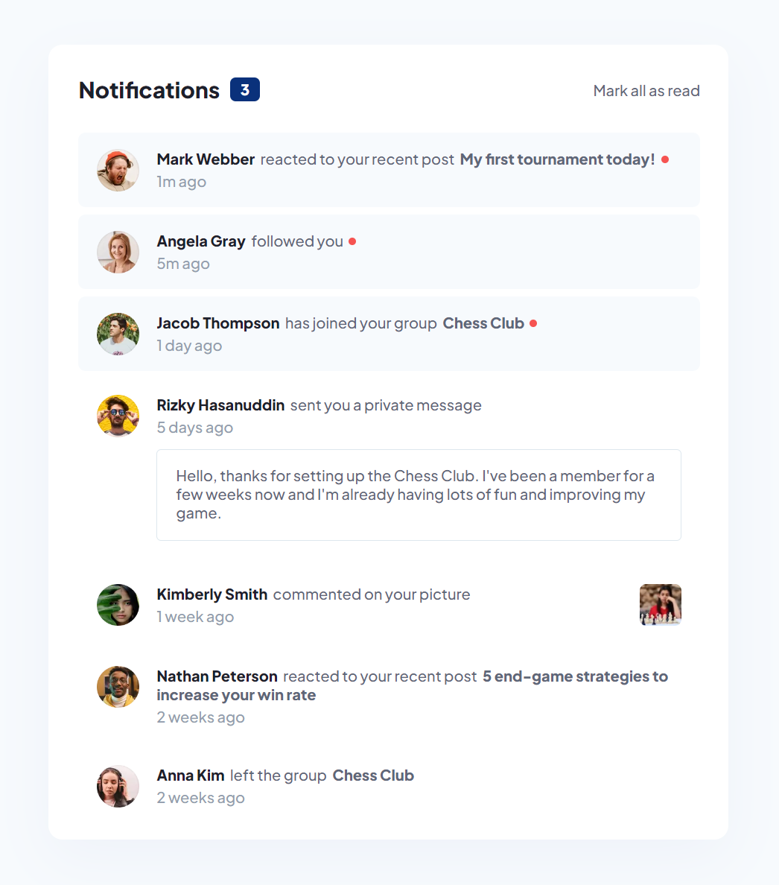
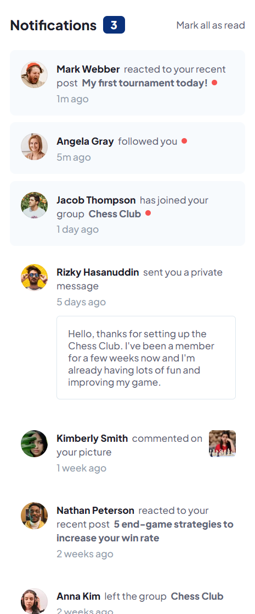

# Frontend Mentor - Notifications page solution

This is a solution to the [Notifications page challenge on Frontend Mentor](https://www.frontendmentor.io/challenges/notifications-page-DqK5QAmKbC). Frontend Mentor challenges help you improve your coding skills by building realistic projects. 

### Links

- Solution URL: https://github.com/aaronrubinstein/notifications-page
- Live Site URL: https://aaronrubinstein.github.io/notifications-page/

### Screenshots

**Desktop**

**Mobile**

